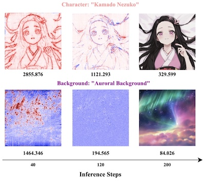

Xiandong Zou is a PhD student in Computer Science supervised by [Pan Zhou](https://panzhous.github.io/) at Singapore Management University. He is a member of LV lab. He received his bachelor and master degree from [Imperial College London](https://www.imperial.ac.uk/mathematics/), majoring in Mathematics, where he researched at [DeepWok Lab](https://deepwok.github.io/) with [Prof. Aaron Zhao](https://aaron-zhao123.github.io/) on machine learning projects.

Selected Publication
-----
<!-- Paper 1 -->

  
  
  

    <h3 style="margin-top: 0;">Cached Multi-Lora Composition for Multi-Concept Image Generation</h3>
    

      <b>Xiandong Zou</b>, Mingzhu Shen, Christos-Savvas Bouganis, Yiren Zhao 
      <i>The Thirteenth International Conference on Learning Representations</i> (ICLR 2025). 
      <a href="https://arxiv.org/abs/2502.04923">Paper</a> |
      <a href="https://github.com/Yqcca/CMLoRA">Project Page</a> 
    

  

<!-- Paper 2 -->

  
  
  

    <h3 style="margin-top: 0;">Will More Expressive Graph Neural Networks do Better on Generative Tasks?</h3>
    

      <b>Xiandong Zou</b>, Xiangyu Zhao, Pietro Liò, Yiren Zhao 
      <i>Learning on Graphs Conference</i> (LOG). PMLR, 2024. 
      <a href="https://arxiv.org/abs/2308.11978">Paper</a> |
      <a href="https://github.com/Yqcca/graph-generative-models">Project Page</a> 
    

  

HONORS & AWARDS
-----
* 2023 & 2024 Imperial College UROP Award
* 2022 Dean's List at Imperial College London
* 2019 American Mathematics Competition 12: Certificate of Distinction
* 2019 Euclid Mathematic Contest: Certificate of Distinction
* 2019 34th Annual AAPT PhyscisBowl Contest: Honorable Award
