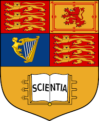

Hi! I am a MSci student in Mathematics at [Imperial College London](https://www.imperial.ac.uk/mathematics/). My previous research works focus on AI+, generative models and filtering. My research interests are quite flexible, mainly lying in the fields of generative models, AIGC (2D, 3D), LLM alignment and embodied AI.

Currently, I am actively learning and exploring advanced algorithms and models to solve complex data-driven problems in the real world. My goal is to develop explainable deep learning models to better assist people with day-to-day tasks in the era of big data.

Education
-----

### Imperial College London

Oct 2023 - Jun 2024 
MSci in Mathematics 

-----

### Imperial College London

Oct 2020 - Jun 2023 
BSc in Mathematics 

Interests
-----
* Reinforcement Learning
* Generative Models
* LLM Alignment
* Parameter-Efficient Fine-Tuning
* Probabilistic Models
* Bayesian Inference

HONORS & AWARDS
-----
* 2023 & 2024 Imperial College UROP Award
* 2022 Dean's List (Year 2) at Imperial College London
* 2019 American Mathematics Competition 12: Certificate of Distinction
* 2019 Euclid Mathematic Contest: Certificate of Distinction
* 2019 34th Annual AAPT PhyscisBowl Contest: Honorable Award
