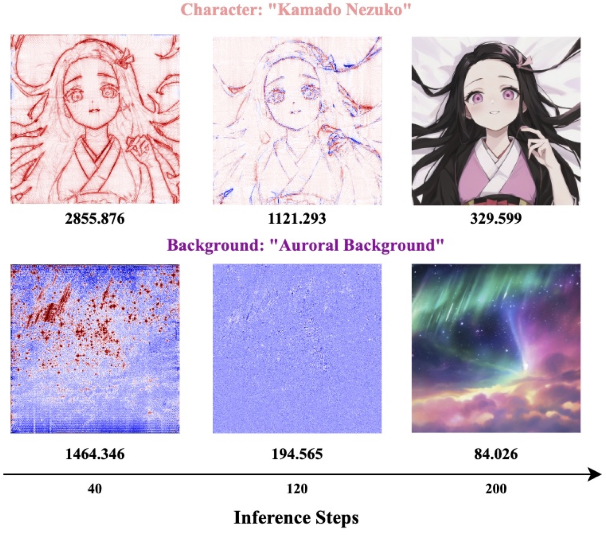
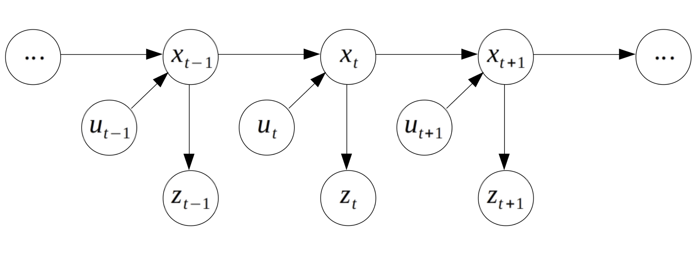



  
  

    <h3 style="margin-top: 0;">Cached Multi-Lora Composition for Multi-Concept Image Generation</h3>
    

      
        <i>The Thirteenth International Conference on Learning Representations (ICLR 2025).</i>
       
      Master Research Opportunities Programme, 2024. 
      
        <a href="https://arxiv.org/abs/2502.04923">Paper</a> |
        <a href="https://github.com/Yqcca/CMLoRA">Project Page</a>
      
    

  

  
  

    <h3 style="margin-top: 0;">GNN Expressiveness and Graph Generative Models</h3>
    

      
        <i>Learning on Graphs Conference (LOG).</i> PMLR, 2024.
       
      Undergraduate Research Opportunities Programme, 2023. 
      
        <a href="https://arxiv.org/abs/2308.11978">Paper</a> |
        <a href="https://github.com/Yqcca/graph-generative-models">Project Page</a>
      
    

  

  
  

    <h3 style="margin-top: 0;">Explainable AI for Image Segmentation based on COVID-19</h3>
    

      Undergraduate Research Opportunities Programme, 2022. 
      
        <a href="https://github.com/Yqcca/tutorials">Project Page</a>
      
    

  

  
  

    <h3 style="margin-top: 0;">Bayesian Filtering</h3>
    

      M2R Group Research Project, 2022. 
      
        <a href="https://github.com/Yqcca/Filters">Project Page</a>
      
    

  

