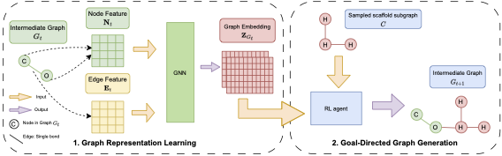
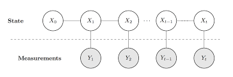



### GNN Expressiveness and Graph Generative Models

<i>Learning on Graphs Conference</i>. PMLR, 2024. 
Undergraduate Research Opportunities Programme, 2023. 
Used PyTorch, PyTDC, and Torchdrug to reproduce and improve current graph representation modules in
graph generative models. 
<a href="https://arxiv.org/abs/2308.11978">Paper</a> |
<a href="https://github.com/Yqcca/graph-generative-models">Project Page</a> 
 

-----

### Explainable AI for Image Segmentation based on COVID-19

Undergraduate Research Opportunities Programme, 2022. 
Used PyTorch, Tensorflow, and MONAI to construct deep learning models to segment images related to
healthcare and reproduce explainable modules in relevant papers. 
<a href="https://github.com/Yqcca/tutorials">Project Page</a> 
 

-----

### Bayesian Filtering

Group Research Project, 2022. 
Implemented the algorithms for several particle filters in Python. 
<a href="https://github.com/Yqcca/Filters">Project Page</a> 
 

